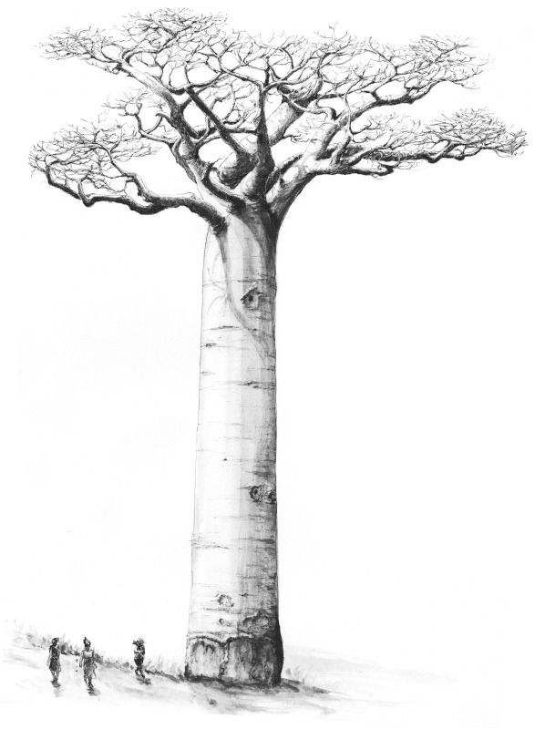
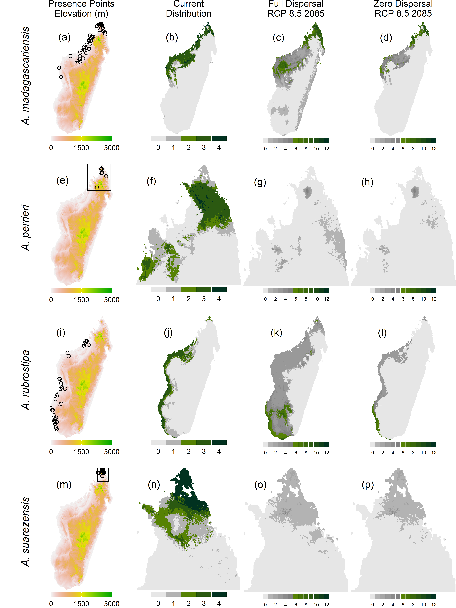

# Range shifts of baobabs as climate warms 

This GitHub repository includes the code and data for the following scientific article:

**TAGLIARI Mario M., Pascal DANTHU, Jean-Michel LEONG POCK TSY, Cyrille CORNU, Jonathan LENOIR, Vítor CARVALHO-ROCHA, Ghislain VIEILLEDENT.** 2021. Not all species will migrate poleward as the climate warms: the case of the seven baobab species in Madagascar. _Global Change Biology_.
doi: [10.1111/gcb.15859](https://doi.org/10.1111/gcb.15859).

## Baobab occurrence data

The `data/baobabs/` folder includes the occurrence dataset for the seven baobab species present in Madagascar (file `data_Adansonia.csv`). This file is the result of years of field inventories in Madagascar by botanists and ecologists working at [CIRAD](https://www.cirad.fr).

## R script

All the results of the study can be reproduced executing the R script `R/baobabs.R`. To do so, you can either execute the `baobabs.sh` shellscript or run the R script using a R GUI such as RStudio.

## Results

All the results of the study (tables and figures) are saved in the `outputs` folder.

Figure: **Species range contraction under climate change for the four threatened baobab species.** The four species are _A. madagascariensis_, _A. perrieri_, _A. rubrostipa_, and _A. suarezensis_ (one species per row). (a, e, i, m) Occurrence points over Madagascar elevation map (elevation in m); (b, f, j, n) Current predicted species distribution. Legend indicates the number of models (0-4) predicting the species presence; (c,g,k,o) Projected species distribution in 2085 under scenario RCP 8.5 and the full-dispersal hypothesis. Legend indicates the number of models (0-12) predicting the species presence; (d,h,l,p) Projected species distribution in 2085 under scenario RCP 8.5 and the zero-dispersal hypothesis. Legend indicates the number of models (0-12) predicting the species presence. For the distribution maps, the species is assumed to be present (green areas) when a majority of models predicts a presence (votes >= 2 in the present, and >= 6 in the future). The species is considered absent (grey areas) when no model (votes = 0), or a minority of models (votes < 2 in the present, and < 6 in the future), predicts a presence. Maps for _A. perrieri_ and _A. suarezensis_, two species distributed at the extreme North of Madagascar, have been zoomed in (black squares).

## Notes

An archive of this repository is available in the Cirad Dataverse repository: \[DOI: [10.18167/DVN1/LIALRR](https://doi.org/10.18167/DVN1/LIALRR)\].

Baobab drawings by **Grazyna Krecka-Duchaufour** from "**C. Cornu and P. Danthu.** 2015. _Guide d'identification illustré des baobabs de Madagascar_. Cirad, Montpellier. 30 p." 
