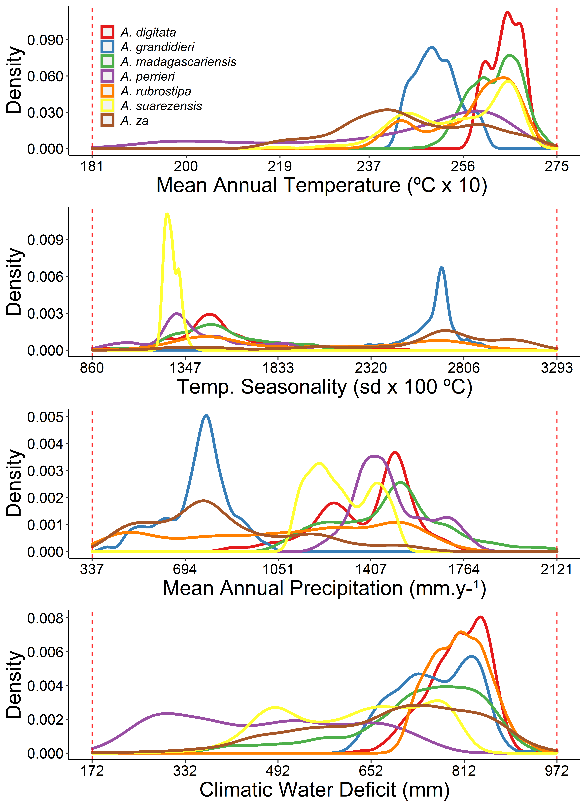

# baobabs_mada

# Not all species should migrate towards the Poles under climate change: the case of the seven Baobab species in Madagascar

## R script

The R script `R/baoabas.R` can be run to reproduce the results of the following study:

**MUNIZ TAGLIARI Mario, Vitor CARVALHO-ROCHA, Pascal DANTHU, Jean-Michel LEONG POCK TSY, Cyrille CORNU, Jonathan LENOIR, Ghislain VIEILLEDENT**. 2020. Not all species should migrate towards the Poles under climate change: the case of the seven Baobab species in Madagascar.

To run the script, you can either execute the `baobabs.sh` shellscript file or run the R script under a R GUI such as RStudio.

## Data

Data can be found in the `data` folder. The `baobabs_raw_data` folder includes several `.csv` files with raw occurrence data for the seven baobab species that can be found in Madagascar. These files are the result of more than 10 years (since 2004) of field inventories by botanists and ecologists at [CIRAD](https://www.cirad.fr).

## Results

All the results are saved in the `outputs` folder.

Figure 1: **Bioclimatic niche of the seven baobabs species found in Madagascar**.

Check the most threatened baobab species.

Figure 2: **The most threatened Malagasy baobab species (2085) under two dispersal hypothesis (Full-Dispersal and Zero-Dispersal) and RCP 8.5**.

Also check how latitude and elevation will change inside threatened baobab projected distribution in the present and in the future (2055 and 2085).

Figure 3: **The change in elevation and latitude inside projected distribution of the most threatened baobabs species**.
## Additional folders

- The `manuscript` folder includes the `manuscript.Rmd` file with the sources code used to write the scientific article `manuscript.pdf`.
- The `bib` folder includes the bibliographic references (`baobabs.bib`) and the bibliographic format (`*.csl`).

## License

Data and R script are available under the GNU General Public License version 3 (see `LICENSE` file).
